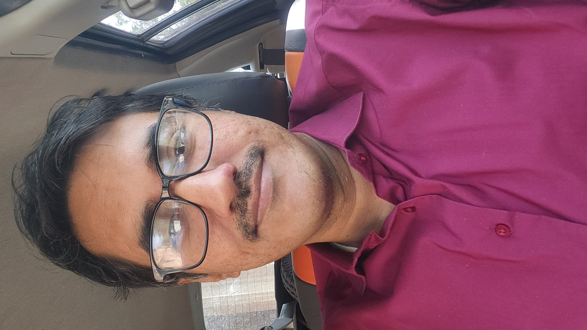

  
  

   I'm Inam, passionate about technology, crypto, forex trading as well as developing AI apps. On my repo ull find mt4 expert advisors of different types along with binance API wrappers.

I graduated from University of Peshawar then proceeded to do masters from LUMS Lahore. I was selected as Erusmus Mundus Scholar to study at University of York in partial fulfillment of masters degree. I used to love hiking and paraglading though things changed when i was diagnosed with Polymyositis. I have since devoted my efforts towards awareness about this rare disease. 

I work at Islamia College Peshawar since 2016 teaching at undergraduate level.
  

